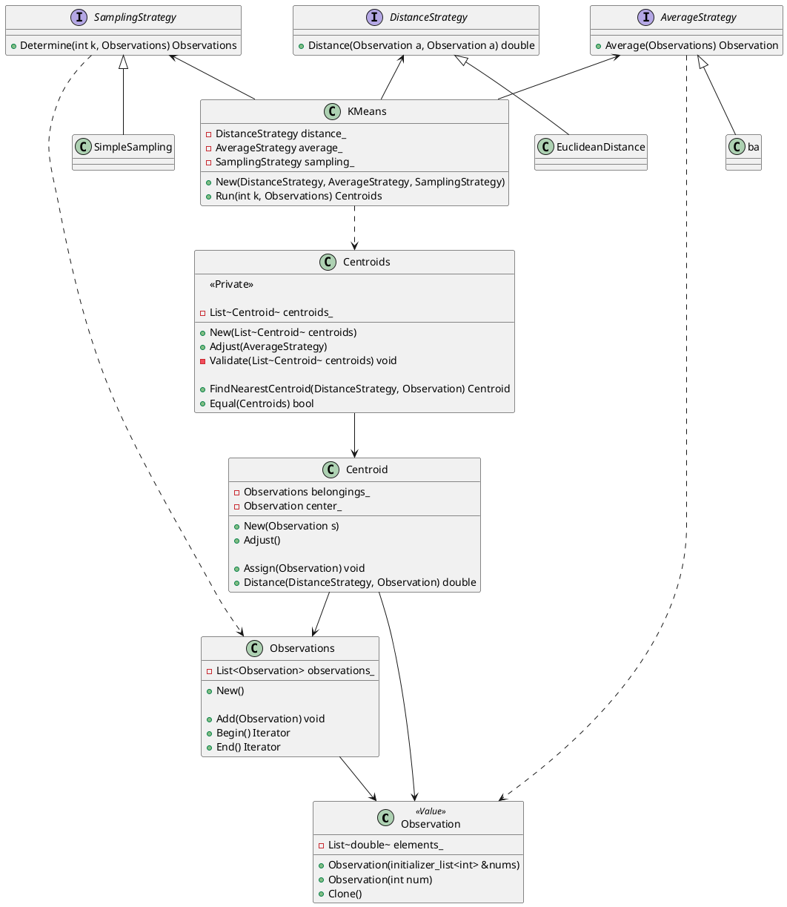

```plantuml
@startuml
class Observation <<Value>> {
    -List~double~ elements_

    +Observation(initializer_list<int> &nums)
    +Observation(int num)
    +Clone()
}

class Observations {
    -List<Observation> observations_

    +New()

    +Add(Observation) void 
    +Begin() Iterator
    +End() Iterator
}

Observations-->Observation

class Centroid {
    -Observations belongings_
    -Observation center_

    +New(Observation s)
    +Adjust()

    +Assign(Observation) void
    +Distance(DistanceStrategy, Observation) double
}

Centroid-->Observations
Centroid-->Observation

class Centroids {
    <<Private>>

    -List~Centroid~ centroids_

    +New(List~Centroid~ centroids)
    +Adjust(AverageStrategy)
    -Validate(List~Centroid~ centroids) void

    +FindNearestCentroid(DistanceStrategy, Observation) Centroid 
    +Equal(Centroids) bool
}

Centroids-->Centroid

class KMeans {
    -DistanceStrategy distance_
    -AverageStrategy average_
    -SamplingStrategy sampling_

    +New(DistanceStrategy, AverageStrategy, SamplingStrategy)
    +Run(int k, Observations) Centroids
}

KMeans..>Centroids

interface SamplingStrategy {
    +Determine(int k, Observations) Observations
}

SamplingStrategy<|--SimpleSampling
SamplingStrategy..>Observations
SamplingStrategy<--KMeans

interface DistanceStrategy {
    +Distance(Observation a, Observation a) double
}

DistanceStrategy<|--EuclideanDistance
DistanceStrategy<--KMeans

interface AverageStrategy {
    +Average(Observations) Observation
}

AverageStrategy<--KMeans
AverageStrategy..>Observation
AverageStrategy<|--Dba
@enduml
```